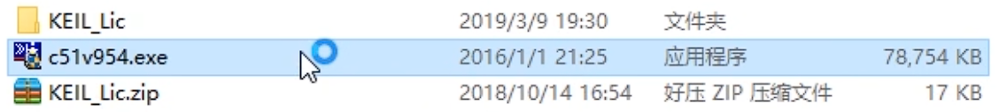
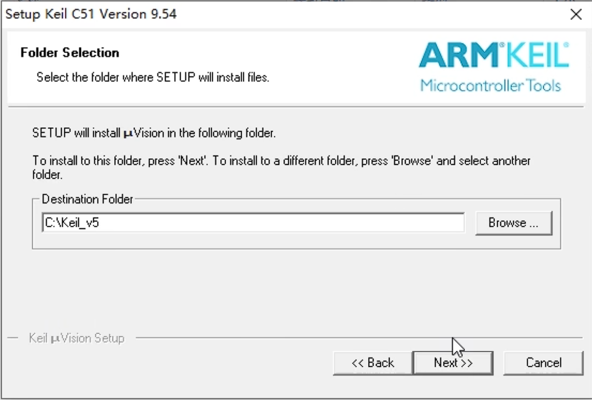
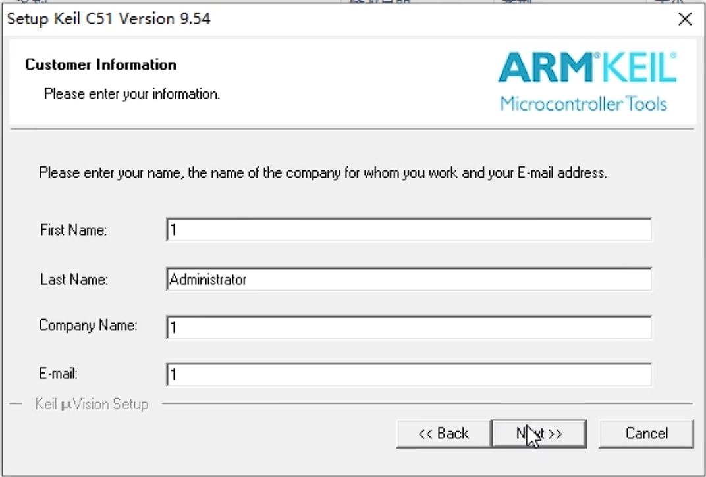
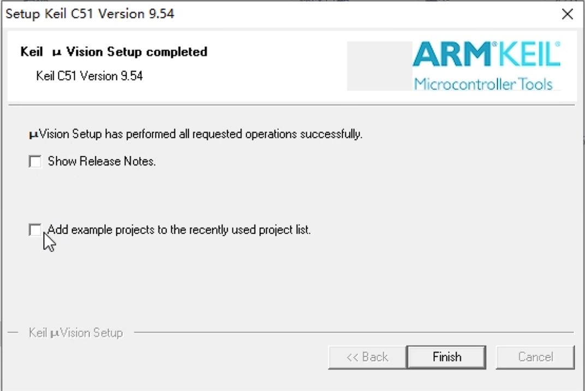
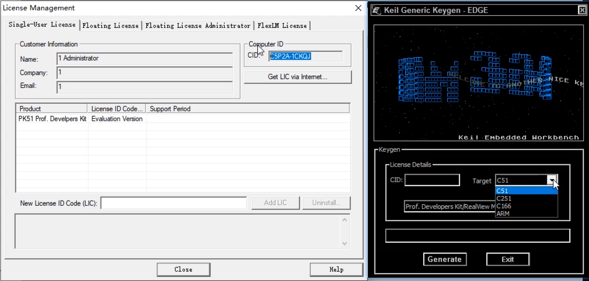
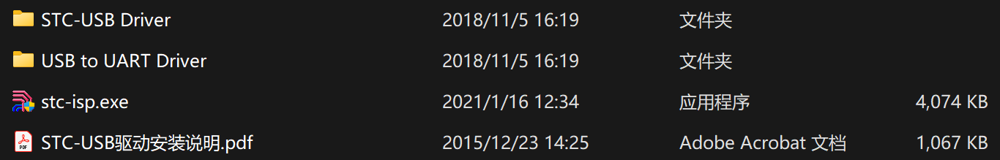

# 安装Keil5 C51

官网：[Keil Product Downloads](https://www.keil.com/download/product/) (外网慢不推荐)

1. 解压缩`Keil5 C51.zip` 

2. 双击`c51v954.exe`

    

3. 点击`Next` 、勾选`I agree...` 、点击`Next` 

4. 选择安装目录`Core:` `D:\_EmbeddedSystemTool\Keil_v5`  [目录路径为英文]、点击`Next` 

    

5. "Customer Information"随便填、点击`Next` 

    

6. 取消`Show Release Notes` 、例程，点击`Finish` 

    

7. 破解：以管理员权限运行keil_v5，`文件-License Management` ，复制`CID`，解压安装目录下`keygen_new2032.zip` (关闭杀毒软件)，运行`keygen_new2032.exe` ，粘贴`CID` 的值，`Target`选择`C51`，点击`Generate`，复制生成的序列码，点击`Exit`，粘贴进`New License ID Code`，点击`Add LIC`，提示"LIC Added Sucessfully"，注册成功，可使用到2032年

    

* **因版权问题，在公司使用时禁用联网、位置服务**

# 安装stc-isp

官网：[STMCU中文官网](https://www.stmcu.com.cn/)

1. 解压缩`stc-isp.zip`

    

2. 将`stc-isp`文件复制到目录`D:\_EmbeddedSystemTool\`

3. 若连接USB数据线不能识别，安装驱动程序：将USB数据线连接开发板，`设备管理器-其他设备-(黄色感叹号：USB2.0-Serial)` ，在`stc-isp\USB to UART Driver`打开`CH340_CH341`，双击`ch341ser.exe-安装`，`驱动安装成功！` ，会有`C:\WCH.CN\CH341SER` ，`设备管理器-端口(COM 和 LPT)-USB-SERIAL CH340(COMx)` 

   > 提示`驱动预安装成功`，一般是开发板未连接电脑

