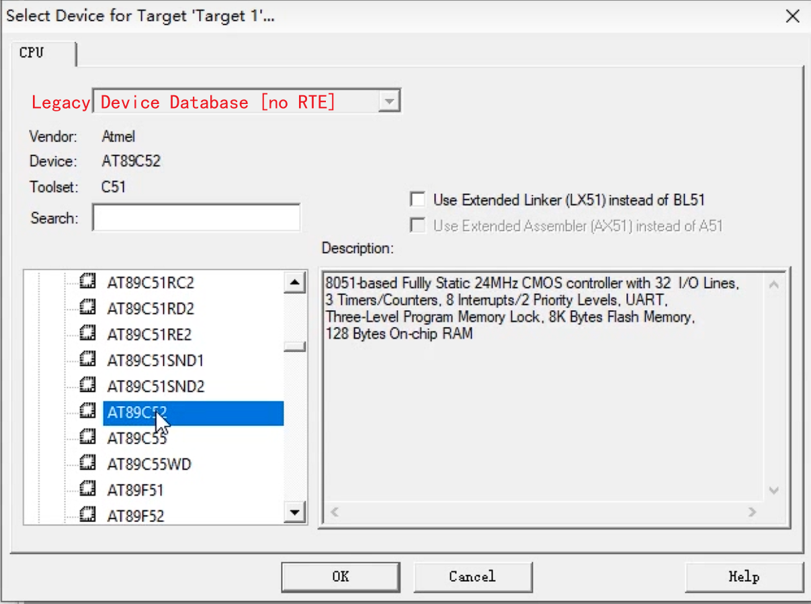
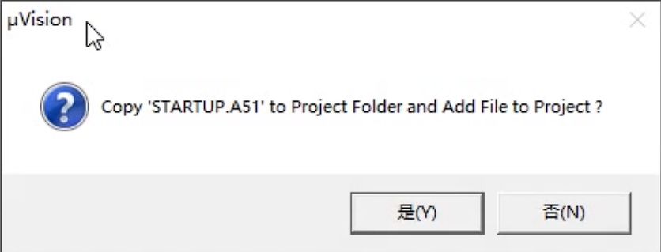
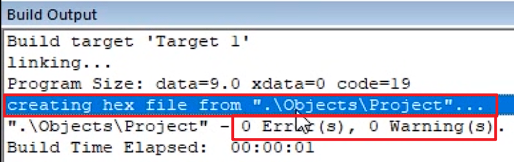
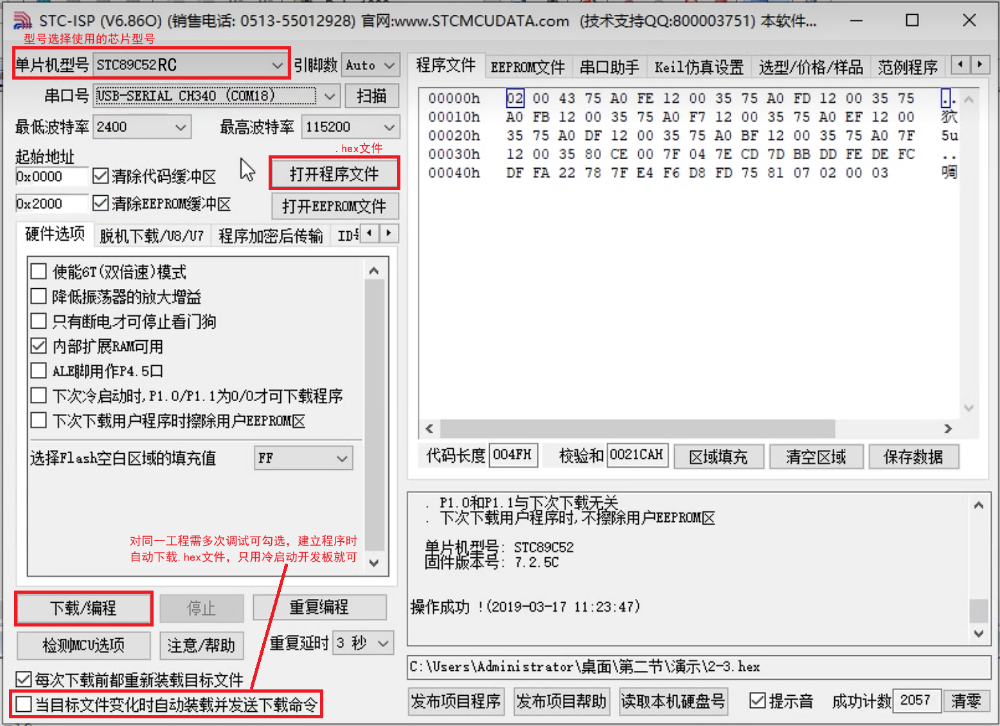

# 新建工程文件夹目录

## \MDK-ARM

Project.uvprojx ——Keil工程启动文件

## \User

用户文件

main.c ——工程主程序文件

readme.txt——工程说明文件

### \\\Hardware

片外模块的模块化函数库

### \\\System

片上模块的模块化函数库

## \keilkill.bat

清除编译生成的中间文件，减小工程文件大小，便于发布工程文件


# 新建工程框架

1. 打开`Keil uVisin5`，`Project——New uVision Project——总目录——项目目录(可以是中文表示项目是干什么的)——MDK-ARM文件夹(工程启动文件夹)——新建Project.uvprojx文件`，保存

2. 在`Select Device...`选择`Legacy Device Database [no RTE]`，[学习的芯片为STC89C52(国产)]选择`AT89C52` 
   在Microchip下找，或者直接搜索

    

3. `Copy 'STARTUP.A51` 建启动文件，不需要更改，选否

    

4. 在Manage Project Items（红绿白品图标）中
   将Project Targets下的Target 1 重命名为Template
   在Groups下建立工程框架，User\\Hardware、User\\System、User，点OK
   在Project树下，右键User，选择`Add New Item to Group 'Source Group 1'` ，选择`C File (.C)` ，Name: main，Location：选择项目文件夹中的User文件夹


# 魔术棒设置

在`Options for Target...`

在Output下勾选`Create HEX File-ok`

在C51下，Include Paths下，设置 头文件地址：..\User\Hardware、..\User\System、..\User，点OK


# 编辑程序并编译

1. 编辑`main()`函数
   编辑main函数

   ```c
   void main() {
   }
   ```

   （在main.c文件中第一行右键，选择 Insert '#include <REGX52.H>'，包含51单片机的头文件）

   

2. Translate——编译、 **Build——建立(常用)**、 Rebuild——建立所有工程、 **Download——下载(常用)**
   点击`Build 建立`  工程，`Build Output`显示`0 Error(s), 0 Warning(s)`，说明工程框架没有问题，可以开始正常的开发51单片机

    


# 下载到单片机

   使用数据线将51单片机连接至电脑，打开 stc-isp软件，单片机型号选择`STC89C52RC`，串口号可以自动搜索，打开程序文件，选择`项目目录\Objects\Project.hex`， 点击`下载/编程` ，重置51开发板的开关冷启动，开发板开始执行程序

    

