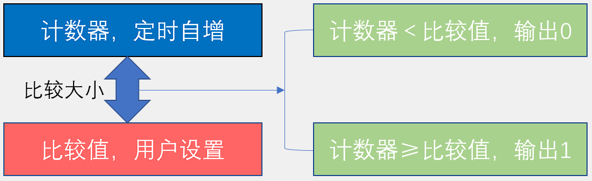
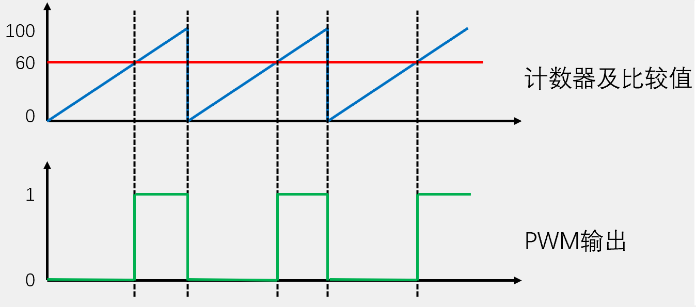
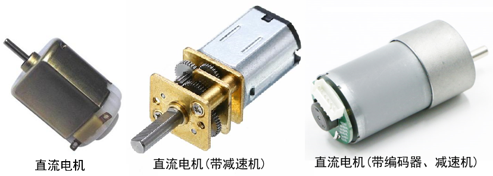
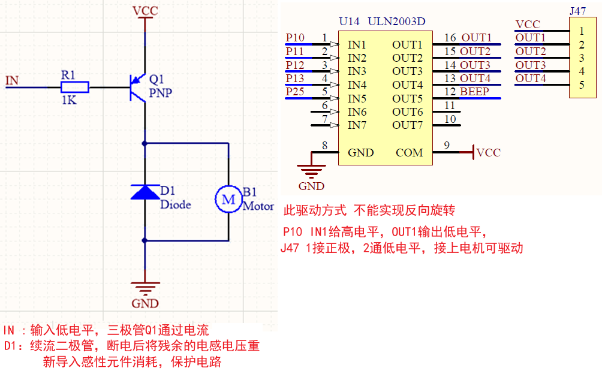
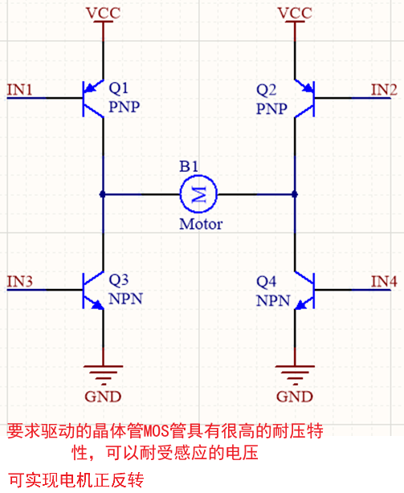

# 产生PWM方法

* 模型结构

   

* 波形

   


# 直流电机介绍

* 直流电机是一种将电能转换为机械能的装置。一般的直流电机有两个电极，当电极正接时，电机正转，当电极反接时，电机反转

* 直流电机主要由永磁体（定子）、线圈（转子）和换向器组成

   

* 除直流电机外，常见的电机还有步进电机、舵机、无刷电机、空心杯电机等


# 电机驱动电路

* 大功率器件直接驱动

   

* H桥驱动

   

 

# 利用IO口的翻转延时实现PWM LED呼吸灯

缺点：占用主循环，占用CPU不能干其他事情

```c
#include <REGX52.H>

sbit LED = P2^0;

void Delay(unsigned int t)
{
    while(t --);
}

void main()
{
    unsigned char Time,i;
    while(1)
    {
        for(Time=0;Time<100;Time++) //LED由暗变亮
        {
            for(i=0;i<20;i++) //每个亮度循环20次
            {
                LED = 0;
        		Delay(Time);
        		LED = 1;
        		Delay(100 - Time);
            }
        }
        for(Time=100;Time>0;Time--) //LED由亮变暗
        {
            for(i=0;i<20;i++) //每个亮度循环20次
            {
                LED = 0;
        		Delay(Time);
        		LED = 1;
        		Delay(100 - Time);
            }
        }
    }
}
```


# PWM利用定时器中断实现调速

```c
#include <REGX52.H>
#include "Delay.h"
#include "Key.h"
#include "Nixie.h"
#include "Timer0.h"

sbit Motor=P1^0;
unsigned char Counter,Compare;
unsigned char KeyNum,Speed;

void Timer0_Init() //定时器初始化 100us@12MHz
{
	TMOD &= 0xF0; //设置定时器模式
	TMOD |= 0x01; //设置定时器模式
	TL0=0x9c; //设置定时初值
    TH0=0xff; //设置定时初值
	TF0 = 0; //清除TF0标志
	TR0 = 1; //定时器0开始计时
  	ET0 = 1; //T0的溢出中断允许位
  	EA = 1; //CPU总中断允许控制位
  	PT0 = 0; //定时器0中断优先级控制位 默认为0  
}

void main()
{
    Timer0_Init();
    
    while(1)
    {
        KeyNum=Key();
        if(KeyNum==1)
        {
            Speed++;
            Speed%=4;
            if(Speed==0){Compare=0;}
            if(Speed==1){Compare=20;}
            if(Speed==2){Compare=50;}
            if(Speed==3){Compare=100;}
        }
        Nixie(1,Speed);
    }
}

void Timer0_Routine() interrupt 1
{
    TL0=0x9c; //设置定时初值
    TH0=0xff; //设置定时初值
    Counter++;
    Counter%=100; //计数器定时自增，到100清零
    if(Counter<Compare)
    {
        Motor=1;
    }
    else
    {
        Motor=0;
    }
}
```

