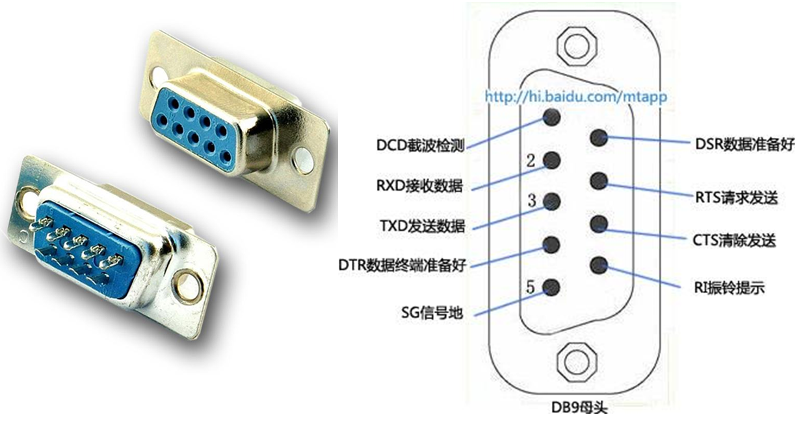
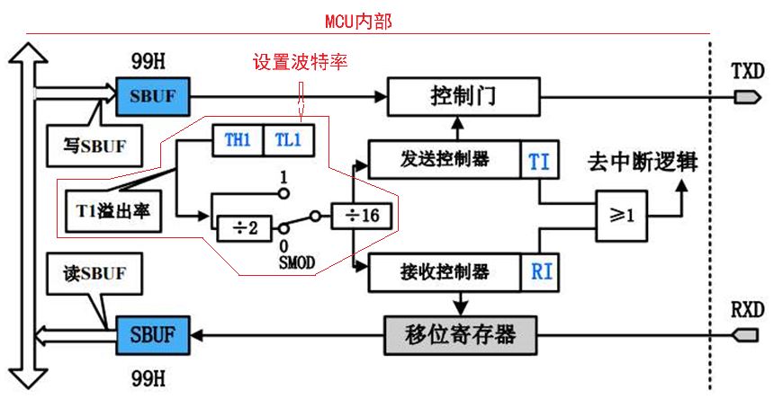
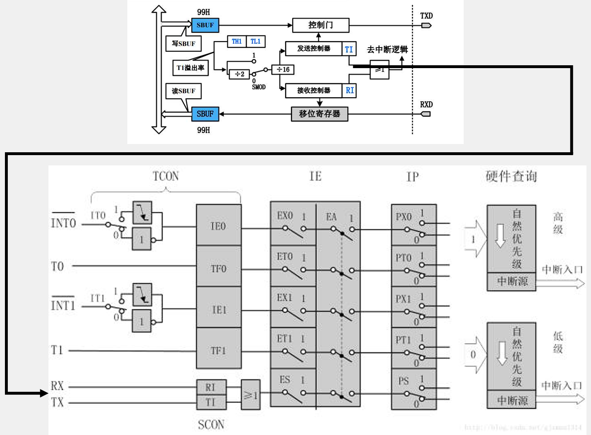
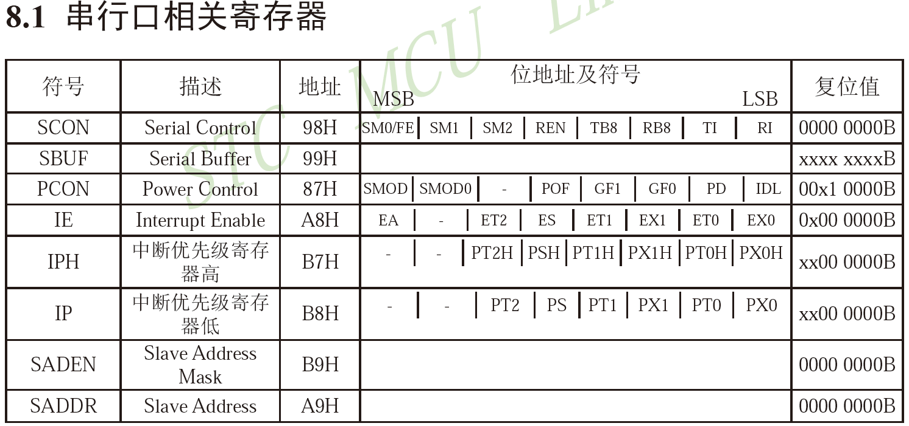
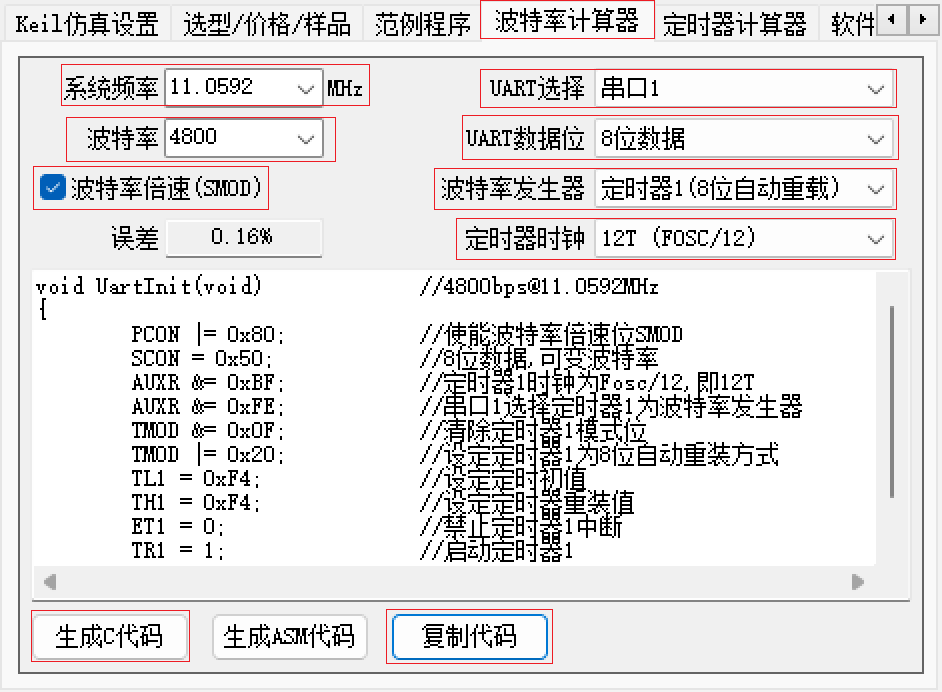

# 接口及引脚定义

串口的标准接口：DB9公母头

 

多的引脚是用来进行 数据流控制的


# 常见通信接口比较

| **名称** | **引脚定义**         | **通信方式** | **特点**       |
| -------- | -------------------- | ------------ | -------------- |
| UART     | TXD、RXD             | 全双工、异步 | 点对点通信     |
| I²C      | SCL、SDA             | 半双工、同步 | 可挂载多个设备 |
| SPI      | SCLK、MOSI、MISO、CS | 全双工、同步 | 可挂载多个设备 |
| 1-Wire   | DQ                   | 半双工、异步 | 可挂载多个设备 |

此外还有：CAN、USB等


# 51单片机的UART

* STC89C52有1个UART (管脚图中RxD/P3.0、TxD/P3.1)

* STC89C52的UART有四种工作模式：

   模式0：同步移位寄存器

   模式1：8位UART，波特率可变（常用）

   模式2：9位UART，波特率固定

   模式3：9位UART，波特率可变


# 串口模式图

 

* SBUF (server and buffer)：串口数据缓存寄存器，物理上是两个独立的寄存器，但占用相同的地址。写操作时，写入的是发送寄存器，读操作时，读出的是接收寄存器


# 串口和中断系统

 

这里使用的中断系统图是传统51单片机的图，STC89C52的中断系统图可参考手册


# 串口相关的寄存器

<STC89C52系列单片机器件手册> P234

 


# 数据显示模式

在串口助手中

* HEX模式/十六进制模式/二进制模式：以原始数据的形式显示
* 文本模式/字符模式：以原始数据编码后的形式显示


# 波特率计算器生成

 

```c
void UartInit(void)		//4800bps@11.0592MHz
{
	PCON |= 0x80;		//使能波特率倍速位SMOD
	SCON = 0x50;		//8位数据,可变波特率
	//AUXR &= 0xBF;		//定时器1时钟为Fosc/12,即12T
	//AUXR &= 0xFE;		//串口1选择定时器1为波特率发生器
	TMOD &= 0x0F;		//清除定时器1模式位
	TMOD |= 0x20;		//设定定时器1为8位自动重装方式
	TL1 = 0xF4;		//设定定时初值
	TH1 = 0xF4;		//设定定时器重装值
	ET1 = 0;		//禁止定时器1中断
	TR1 = 1;		//启动定时器1
}

```

