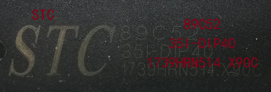

# 什么是单片机

Microcontroller Unit (MCU)

Single-Chip Microcomputer (旧称)

* 内部集成CPU、RAM、ROM、定时器、中断系统、通讯接口等一系列电脑的常用硬件功能
* 任务是信息采集（依靠传感器）、处理（依靠CPU）和硬件设备（例如电机，LED等）的控制
* 单片机跟计算机相比，单片机算是一个袖珍版计算机，一个芯片就能构成完整的计算机系统。但在性能上，与计算机相差甚远，但单片机成本低、体积小、结构简单，在生活和工业控制领域大有所用，同时，学习使用单片机是了解计算机原理与结构的最佳选择

80C51系列单片机是MCS-51系列的典型产品，其他厂商以8051为基核开发的CMOS工艺单片机统称为80C51系列

> Intel：80C31、80C51、87C51、80C32、80C52、87C52
>
> ATMEL：89C51、89C52、89C2051
>
> Philips：华邦、Dallas、STC
>
> Siemens(Infimeon)

# 单片机的应用

使用领域已十分广泛，如智能仪表、实时工控、通讯设备、导航系统、家用电器等。各种产品一旦用上了单片机，就能起到使产品升级换代的功效，常在产品名称前冠以形容词——“智能型”，如智能型洗衣机等

# STC89C52单片机概述

* 所属系列：51单片机系列

* 公司：STC

* 位数：8位

* RAM(随机存储器)：512字节

* ROM(只读存储器)：8K (Flash程序存储)

* 工作频率：12MHz (取决于外部时钟晶振)

* 命名规则：<STC89C52系列单片机器件手册> P19

  STC 89C52RC 40C-PDIP 0721CV4336

  STC厂商、89系列、CMOS工艺、52：2*4K=8K大小ROM(还有51、54、55、58、516)、40：支持晶振最高频率40MHz(运行速度)、C：商业级( I工业级、军用级，支持的温度使用范围不同)、PDIP：封装形式为双列直插式、0721：07年第21周生产、CV4336生产批号

   

   

* 内核结构：<STC89C52系列单片机器件手册> P14、15

   

   

* 管脚图：<STC89C52系列单片机器件手册> P16

   

* 最小应用系统：<STC89C52系列单片机器件手册> P20

  必须有：电源电路、时钟电路、(复位电路可选，用来复位程序)

# 开发板原理图

<开发板原理图_普中-2-3-4>

# 电子元器件规格标识

102 =10 00 =1k

471 =47 0 

473 =47 000 =47k

# 51数据类型

参考 C语言 数据类型

与 C语言的区别？？？

# 51数据运算

参考 C语言 运算符

# C51的sfr、sbit

* sfr（special function register）：特殊功能寄存器声明

  例：sfr P0 = 0x80;

  声明P0口寄存器，物理地址为0x80

* sbit（special bit）：特殊位声明

  例：sbit P0_1 = 0x81;  或  sbit P0_1 = P0^1;

  声明P0寄存器的第1位

* 可位寻址/不可位寻址：在单片机系统中，操作任意寄存器或者某一位的数据时，必须给出其物理地址，又因为一个寄存器里有8位，所以位的数量是寄存器数量的8倍，单片机无法对所有位进行编码，故每8个寄存器中，只有一个是可以位寻址的。

  对不可位寻址的寄存器，若要只操作其中一位而不影响其它位时，可用“&=”、“|=”、“^=”的方法进行位操作

* 

# 单片机基础

C语言基础、数电基础、模电基础，二进制、十进制、十六进制的转换，与、或、非逻辑关系

电平特性：

数字电路中只有两种电平：高、低

> 单片机为TTL电平：高+5V、低0V
>
> 计算机的串口为RS232电平：高-12V、低+12V
>
> 所以计算机与单片机之间通讯需加电平转换芯片max232

# 单片机主要掌握以下几点

最小系统能够运行的必要条件：1. 电源、2. 晶振、 3.复位电路

对单片机任意I/O口的随意操作：1.输出控制电平高低、 2.输入检测电平高低

定时器：掌握最常用的方式2

中断：外部中断、定时器中断、串口中断

串口通信：单片机之间、单片机与计算机之间

 
