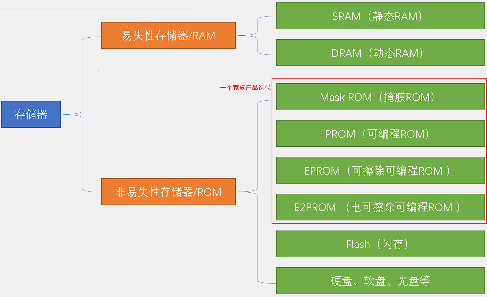
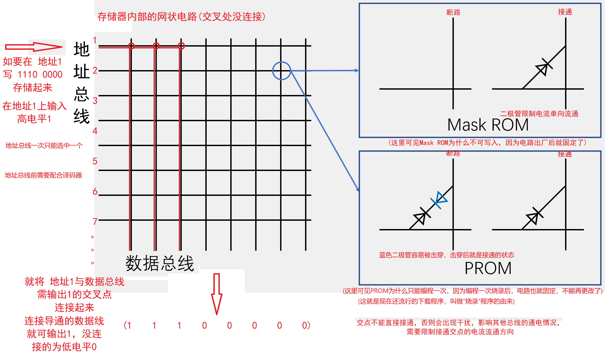

存储器介绍

 

* RAM : Random Access Memory 随机存储器

  存储速度快，掉电丢失数据

  * SRAM

    索存器，用电路存储数据，存储速度最快，容量较少，成本高，应用在CPU高速缓存、变量存储、特殊功能寄存器

  * DRAM

    用电容存储数据，集成度高容值小，漏电现象存电后很快会没电，需加扫描电路，每隔一段时间读取数据再补电，相较SRAM容量更大，成本更低，应用在电脑内存条，手机的运存

* ROM : Read-Only Memory 只读存储器

  存储速度慢，掉电不丢失数据

  * Mask ROM：最早出现，只能读不能写
  * PROM：只能写入1次
  * EPROM：需要用紫外线照射30分钟擦除
  * E2PROM：用电擦除
  * Flash：应用广泛

# 存储器简化模型

 