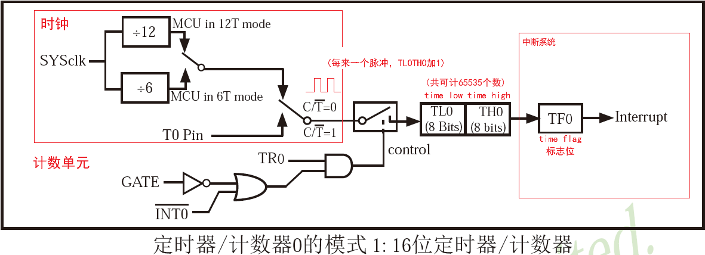
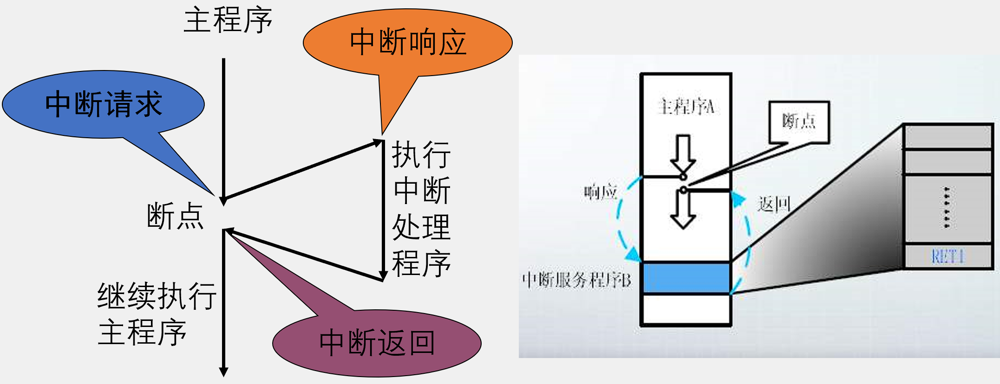
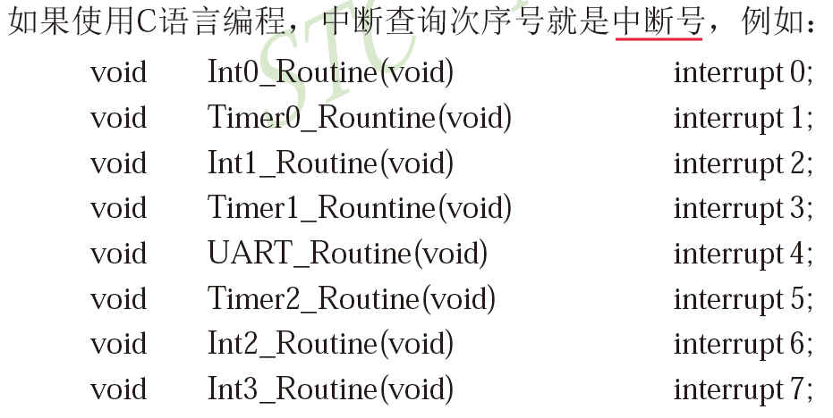
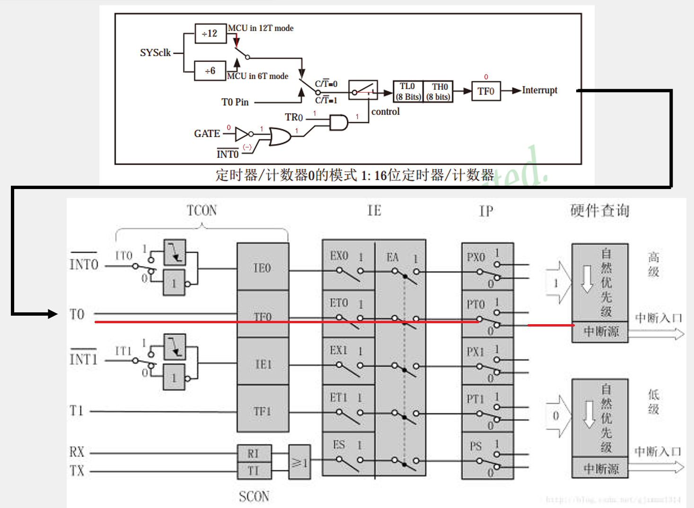
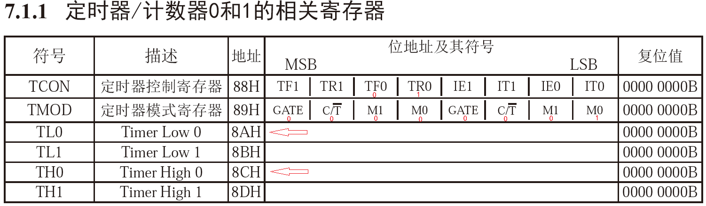
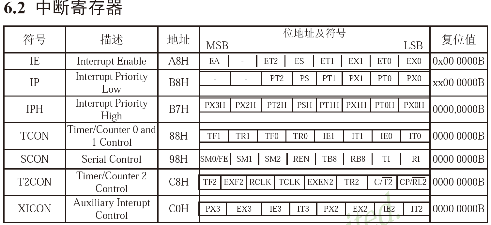
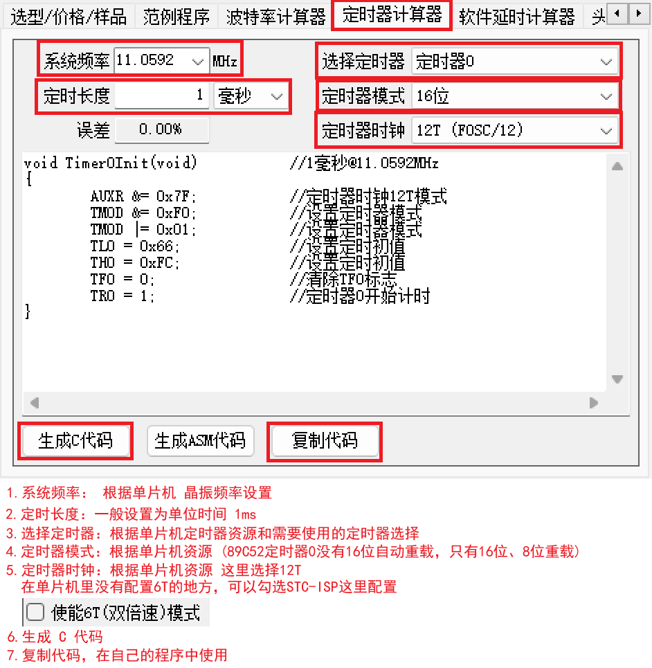

# 定时器介绍

<STC89C52系列单片机器件手册> P187

51单片机的定时器属于单片机的内部资源，其电路的连接和运转均在单片机内部完成


# 定时器的作用

* 用于计时系统，可实现软件计时，或者使程序每隔一固定时间完成一项操作
* 替代长时间的 Delay，提高CPU的运行效率合处理速度
* 。。。


# STC89C52定时器资源

* 定时器个数：3个 (T0、T1、T2) ，T0和T1与传统的51单片机兼容，T2是此型号单片机增加的资源
* 注意：定时器的资源和单片机的型号是关联在一起的，不同的型号可能会有不同的定时器个数和操作方式，但一般来说，T0和T1的操作方式是所有51单片机所共有的


# 定时器框图

定时器在单片机内部就像一个小闹钟一样，根据时钟的输出信号，每隔“一秒”，计数单元的数值就增加一，当计数单元数值增加到“设定的闹钟提醒时间”时 (*这里是计数单元的最大值*)，计数单元就会向中断系统发出中断申请，产生“响铃提醒”，使程序跳转到中断服务函数中执行

 


# 定时器工作模式

* STC89C52的T0和T1均有四种工作模式：

  模式0：13位定时器/计数器

  模式1：16位定时器/计数器（常用）

  模式2：8位自动重装模式

  模式3：两个8位计数器

* 工作模式1框图 <STC89C52系列单片机器件手册> P191

   

   
  

# 定时器时钟

SYSclk：系统时钟，即晶振周期，本开发板上的晶振为12MHz (定时器)

T0 Pin：T0/P3.4  外部I/O引脚 (计时器)

如果 $C/\overline{T}=0$，使用SYSclk；如果  $C/\overline{T}=1$，使用T0 Pin

经过分频后 (12T、6T 两种模式，默认为12T)，12MHz/12T = 1MHz，一个周期为1us


# 定时器中断系统

<STC89C52系列单片机器件手册> P156

* 中断程序流程

   

  相当于同时完成两个任务


# STC89C52中断资源

* 中断源个数：8个（外部中断0、定时器0中断、外部中断1、定时器1中断、串口中断、定时器2中断、外部中断2、外部中断3）

* 中断优先级个数：4个

* 中断号

   

* 注意：中断的资源和单片机的型号是关联在一起的，不同的型号可能会有不同的中断资源，例如中断源个数不同、中断优先级个数不同等等


# 定时器和中断系统

这里使用的中断系统图是传统51单片机的图，STC89C52的中断系统图可参考手册 <STC89C52系列单片机器件手册> P158

 


# 定时器相关寄存器

* 寄存器是连接软硬件的媒介

* 在单片机中寄存器就是一段特殊的RAM存储器，一方面，寄存器可以存储和读取数据，另一方面，每一个寄存器背后都连接了一根导线，控制着电路的连接方式

* 寄存器相当于一个复杂机器的“操作按钮”

  STC89C52的中断系统图可参考手册 <STC89C52系列单片机器件手册> P187

 

STC89C52的中断系统图可参考手册 <STC89C52系列单片机器件手册> P160

 


## 定时器计算器生成

 

```c
void Timer0Init(void)		//1毫秒@11.0592MHz
{
	//AUXR &= 0x7F;		//定时器时钟12T模式  (89C52没有配置该模式的地方，需取消,默认为12T模式)
	TMOD &= 0xF0;		//设置定时器模式
	TMOD |= 0x01;		//设置定时器模式
	TL0 = 0x66;		//设置定时初值
	TH0 = 0xFC;		//设置定时初值
	TF0 = 0;		//清除TF0标志
	TR0 = 1;		//定时器0开始计时
  //中断寄存器配置
  ET0 = 1; //T0的溢出中断允许位
  EA = 1; //CPU总中断允许控制位
  PT0 = 0; //定时器0中断优先级控制位 默认为0
}
```


